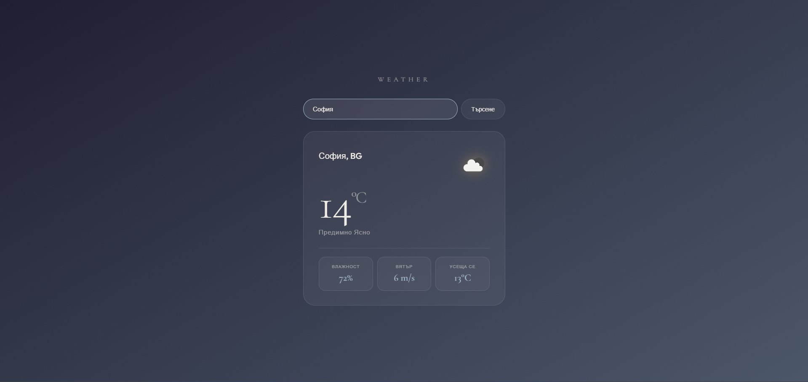

# 🌤️ Weather App

A dynamic weather app that detects your location automatically and adapts its visual theme to current conditions. Search any city for live temperature, humidity, wind speed, and feels-like data.

## Features

- Auto-detects your location on load
- Dynamic background theme based on weather conditions
- Temperature, humidity, wind speed & feels-like data
- Fully responsive — mobile, tablet, desktop

## Tech Stack

- Vanilla JS
- Vite
- OpenWeather API

## Live Demo

[https://alexanderstamenkov.github.io/weather-app/](https://alexanderstamenkov.github.io/weather-app/)

## Preview

